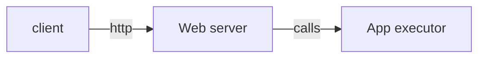

## Dataservice workers

Holds the functions and execution layer of use cases within the data and infra pipeline.

### Architecture



### Usage

cmd | description
--- | ---
| ``` make run``` | Start the application |
| ``` make docs``` | Show extensive documentation on http://localhost:5000 |
